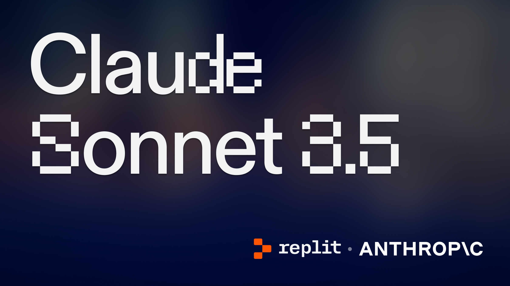

# Chat with Claude Sonnet 3.5

This project allows users to interact with an AI language model using a Gradio interface. The code in `main.py` sets up a chat interface where users can communicate with Claude Sonnet 3.5, a model from Anthropic, and get text responses streamed back.

You can play with a deployed version here: 
https://chat-with-claude-sonnet-3-5.replit.app

<div align="center">
  
</div>

## Code walkthrough

This entire demo lives in `main.py` and is under 50 lines, making it simple and straightforward to understand. Here's a breakdown of what's going on:

### Imports and Initialization

- `os`: For accessing environment variables.
- `gradio as gr`: For creating a user interface.
- `anthropic`: For interacting with the AI model.

```python
import os
import gradio as gr
import anthropic
```

### Client Initialization

- Initializes an Anthropic client using an API key from environment variables.
- Specifies the model to be used (`Claude Sonnet 3.5`).

```python
client = anthropic.Anthropic(api_key=os.environ['ANTHROPIC_API_KEY'])
MODEL = "claude-3-5-sonnet-20240620"
```

### Function `chat_with_replit`

This function takes a user's message and a history of previous messages, constructs the input for the AI model, and yields streaming responses.

```python
def chat_with_replit(message, history):
    messages = []
    response_content = ""

    for h in history:
        u = str(h[0])
        s = str(h[1])

        messages.append({"role": 'user', "content": u})
        messages.append({"role": 'assistant', "content": s})

    messages = messages + [
        {
            "role": "user",
            "content": str(message),
        },
    ]

    with client.messages.stream(
        max_tokens=1024,
        messages=messages,
        model=MODEL,
    ) as stream:
        for text in stream.text_stream:
            response_content += text
            yield response_content
```

### Gradio Interface Setup

- Creates a Gradio Blocks interface with a chat component.
- Provides example prompts and sets the title for the chat interface.
- Launches the Gradio app with a specified favicon and allowed paths.

```python
with gr.Blocks(fill_height=True, head=js) as demo:
    gr.ChatInterface(chat_with_replit,
                    fill_height=True,
                    examples=[
                        "What is the meaning of life?",
                        "What are some fun things to do in San Francisco?",
                        "Interpret 'The Road Not Taken' by Robert Frost"
                    ],
                    title="🚀 Chat with Claude Sonnet 3.5")

demo.launch(favicon_path="assets/favicon.png", allowed_paths=["assets"])
```

## Usage
1. Set the `ANTHROPIC_API_KEY` environment variable with your Anthropic API key.
2. Click "Run"
3. Navigate to the "Webview" tab (ignore the "Output" that might appear, this is a Gradio issue)
4. Tinker and deploy :)

## Notes

- The Gradio interface is customizable. You can modify the examples, title, and design as per your needs.
- Ensure you use Replit Secrets to be sure your API key and other sensitive information are kept secure.